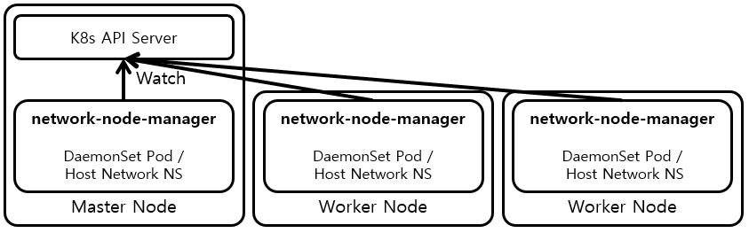

# Network Node Manager

network-node-manager is a kubernetes controller that controls the network configuration of a node to resolve network issues of kubernetes. By simply deploying and configuring network-node-manager, you can solve kubernetes network issues that cannot be resolved by kubernetes or resolved by the higher kubernetes Version. Below is a list of kubernetes's issues to be resolved by network-node-manager. network-node-manager is based on [kubebuilder](https://github.com/kubernetes-sigs/kubebuilder).

* [Connection reset issue between pod and out of cluster](issues/connection_reset_issue_pod_out_cluster.md)
* [External-IP access issue with IPVS proxy mode](issues/external_IP_access_issue_IPVS_proxy_mode.md)
* [DNS packet dropped issue](issues/DNS_packet_dropped_issue.md) 

## Deploy

network-node-manager now supports below CPU architectures.

* amd64
* arm64

Deploy network-node-managers through below command according to kube-proxy mode.

```
iptables proxy mode : kubectl apply -f https://raw.githubusercontent.com/kakao/network-node-manager/master/deploy/network-node-manager_iptables.yml
IPVS proxy mode     : kubectl apply -f https://raw.githubusercontent.com/kakao/network-node-manager/master/deploy/network-node-manager_ipvs.yml
```

## Configuration

### Set Network Stack (IPv4, IPv6)

* Default : "ipv4"
* iptables proxy mode manifest : "ipv4"
* IPVS proxy mode manifest : "ipv4"

```
IPv4      : kubectl -n kube-system set env daemonset/network-node-manager NET_STACK=ipv4
IPv6      : kubectl -n kube-system set env daemonset/network-node-manager NET_STACK=ipv6
IPv4,IPv6 : kubectl -n kube-system set env daemonset/network-node-manager NET_STACK=ipv4,ipv6
```

### Enable Drop Invalid Packet Rule in INPUT chain

* Related issue : [Connection reset issue between pod and out of cluster](issues/connection_reset_issue_pod_out_cluster.md)
* Default : true
* iptables proxy mode manifest : true
* IPVS proxy mode manifest : true

```
On  : kubectl -n kube-system set env daemonset/network-node-manager RULE_DROP_INVALID_INPUT_ENABLE=true
Off : kubectl -n kube-system set env daemonset/network-node-manager RULE_DROP_INVALID_INPUT_ENABLE=false
```

### Enable External-IP to Cluster-IP DNAT Rule

* Related issue : [External-IP access issue with IPVS proxy mode](issues/external_IP_access_issue_IPVS_proxy_mode.md)
* Default : false
* iptables proxy mode manifest : false
* IPVS proxy mode manifest : true

```
On  : kubectl -n kube-system set env daemonset/network-node-manager RULE_EXTERNAL_CLUSTER_ENABLE=true
Off : kubectl -n kube-system set env daemonset/network-node-manager RULE_EXTERNAL_CLUSTER_ENABLE=false
```

### Enable Not Track DNS Packet Rule

* Related issue : [DNS packet dropped issue](issues/DNS_packet_dropped_issue.md)   
* Default : false
* iptables proxy mode manifest : false
* IPVS proxy mode manifest : false

```
On  : kubectl -n kube-system set env daemonset/network-node-manager RULE_NOT_TRACK_DNS_ENABLE=true
Off : kubectl -n kube-system set env daemonset/network-node-manager RULE_NOT_TRACK_DNS_ENABLE=false
```

### Set Kubernetes DNS Service Names for Not Track DNS Packet Rule

* Related issue : [DNS packet dropped issue](issues/DNS_packet_dropped_issue.md)   
* Default : "kube-dns"
* Support multiple : "kube-dns,kube-dns-second"

```
Set kube-dns service  : kubectl -n kube-system set env daemonset/network-node-manager RULE_NOT_TRACK_DNS_ENABLE="kube-dns"
Set multiple services : kubectl -n kube-system set env daemonset/network-node-manager RULE_NOT_TRACK_DNS_ENABLE="kube-dns,kube-dns-second"
```

## How it works?



network-node-manager runs on all kubernetes cluster nodes in host network namespace with network privileges and manage the node network configuration. network-node-manager watches the kubernetes object through kubenetes API server like a general kubernetes controller and manage the node network configuration. Now network-node-manager only watches service object.

## License

This software is licensed under the [Apache 2 license](LICENSE), quoted below.

Copyright 2020 Kakao Corp. <http://www.kakaocorp.com>

Licensed under the Apache License, Version 2.0 (the "License"); you may not
use this project except in compliance with the License. You may obtain a copy
of the License at http://www.apache.org/licenses/LICENSE-2.0.

Unless required by applicable law or agreed to in writing, software
distributed under the License is distributed on an "AS IS" BASIS, WITHOUT
WARRANTIES OR CONDITIONS OF ANY KIND, either express or implied. See the
License for the specific language governing permissions and limitations under
the License.
